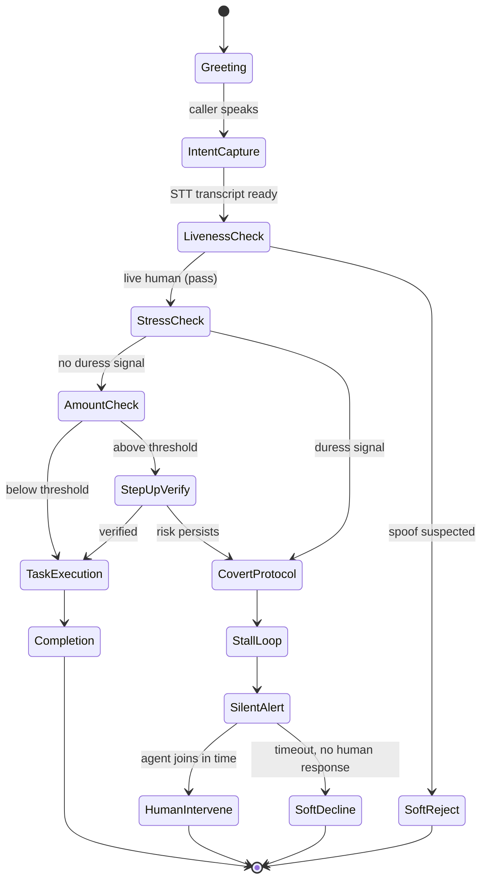
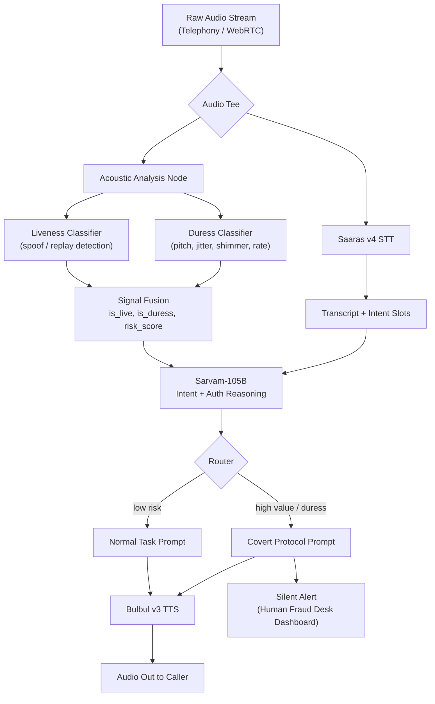

# Voice-Auth & Anti-Spoofing — System Architecture & Build Guide

### ATM/UPI Voice Assistant with Duress-Aware Covert Security Routing

**Stack:** Saaras v4 (STT) · Sarvam-105B (reasoning) · Bulbul v3 (TTS)

---

## 1. Product Blueprint & User Journey

### 1.1 State machine — successful vs. compromised transaction

The core design decision: **liveness and duress checks run continuously, not as a one-time gate.** A caller can pass initial auth and still get flagged mid-call if stress spikes when a transaction amount is spoken aloud — that's the actual coercion pattern (calm during small talk, spike when the number is said).



**Key property:** `CovertProtocol`, `StallLoop`, `SoftDecline` all use ordinary-sounding banking dialogue. Nothing in the audio the caller (or a coercer listening on speakerphone) hears should differ observably from a normal, mildly slow banking call. The only side-channel is the silent alert fired to the human fraud desk.

### 1.2 The Covert Security Protocol — what the agent actually says

Design principle: every stalling line must be **independently plausible as ordinary bank friction.** If it only makes sense as "the AI detected you," it's a bad line — a coercer half-listening will notice a break in tone or a strange justification, and that risks the exact person being protected.

**Stage 1 — soft re-verification (triggered by amount threshold or early stress signal)**

|  | Line |
| --- | --- |
| English | "That's a slightly larger transfer, so I need to re-verify a couple of details before confirming — give me about thirty seconds." |
| Hinglish | "Yeh thoda bada transfer hai, isliye main kuch details dobara verify kar leta hoon — bas tees second lagenge." |

**Stage 2 — active stall (triggered by sustained duress signal)**

|  | Line |
| --- | --- |
| English | "Hmm, I'm not seeing the OTP come through yet on my end. Let me resend it — one moment please." |
| Hinglish | "Mujhe OTP abhi tak nazar nahi aa raha. Main dobara bhej raha hoon — ek minute rukiye." |

**Stage 3 — silent alert fired here (dashboard ping to human fraud desk with session ID, transcript so far, running risk score — caller hears nothing different)**

**Stage 4a — human agent joins in time**

|  | Line |
| --- | --- |
| English | "I'm connecting you to one of our senior support specialists to complete this safely — please stay on the line." |
| Hinglish | "Main aapko hamare senior support specialist se connect kar raha hoon isse surakshit tareeke se poora karne ke liye — line par baniye rahiye." |

**Stage 4b — timeout, no human available: soft decline**

|  | Line |
| --- | --- |
| English | "There's a temporary system delay on this transaction. It's saved as pending, and our team will call you back shortly to complete it." |
| Hinglish | "Is transaction mein thoda system delay ho raha hai. Yeh pending save ho gaya hai, hamari team aapko thodi der mein wapas call karke poora kar degi." |

Note what's absent: no mention of fraud, security, duress, or verification failure. The cover story is always "system is slow," which is unremarkable and non-alarming in Indian banking IVR experience — that's what makes it usable as a real stall rather than a tell.

---

## 2. System Architecture & Data Flow

### 2.1 Where the audio is intercepted

The raw audio stream from the telephony/WebRTC gateway is **teed (forked) before it ever reaches Saaras.** One copy goes to the Acoustic Analysis Node (pure signal processing, no network call to Sarvam), the other is buffered and sent to Saaras STT as normal. This matters for two reasons:

1. **Latency** — acoustic feature extraction runs locally/at the edge in parallel with the STT round-trip, so it doesn't add serial latency to the conversation.
2. **Independence of signal** — the duress/liveness decision must not depend on what Sarvam-105B *thinks* the transcript means. If the acoustic layer only ran after NLP, a well-worded coerced sentence ("please transfer 50000 to this account, everything is fine") would sail through — the whole point is that the acoustic layer catches what the words don't say.

The two branches re-converge at the LLM call: the transcript **and** the `{is_live, is_duress, risk_score}` metadata are passed to Sarvam-105B together, so the routing decision (normal task vs. covert protocol) is made with both channels available.

### 2.2 End-to-end flow



### 2.3 Why this isn't a certified security control (say this to judges before they ask)

Be upfront about scope: acoustic liveness/duress detection is a heuristic risk signal, not a forensic determination. It reduces false negatives on obvious spoofing/coercion patterns; it will have false positives (a caller who's just anxious about a large transfer) and false negatives (a very controlled coercer). The architecture routes to a **human** for the actual decision — the AI's job is triage, not verdict. Also flag, briefly, that voice biometric processing on financial customers has real consent/DPDP-Act implications in a production deployment — worth one slide, not a rabbit hole.

---

## 3. Tech Stack Recommendations

Sarvam covers STT/LLM/TTS. Everything below is the **Pre-NLP Audio Analysis Layer**, which is entirely your build.

### 3.1 Feature extraction

| Library | Use | Why |
| --- | --- | --- |
| **`parselmouth`** (Praat wrapper) | Jitter, shimmer, HNR (harmonics-to-noise ratio) | These are *the* classic voice-quality measures in the stress/affect literature — more validated for this purpose than raw librosa features |
| **`librosa`** | Pitch (F0) contour via `pyin`, RMS energy, speaking rate, zero-crossing rate | Fast, well-documented, good for the rate/energy/pitch-variance side of the signal |
| **`opensmile`** (Python bindings) | eGeMAPS feature set (88 features) | Standard paralinguistic feature set used across affect/emotion-recognition research — one call gives you most of the above plus more, useful if you want a single well-validated feature vector rather than hand-rolling it |
| **`webrtcvad`** | Voice activity detection | Gate processing to speech-only frames; cheap, avoids wasting compute on silence/noise |

### 3.2 Liveness / anti-spoofing

| Option | Notes |
| --- | --- |
| **AASIST** or **RawNet2** (pretrained checkpoints from the ASVspoof challenge lineage, open source on GitHub) | Real anti-spoofing models trained specifically on synthetic/replay speech detection. Export to ONNX for CPU inference. This is the "real" option if you have time to integrate a pretrained checkpoint. |
| **Heuristic fallback for MVP** | Spectral flatness / high-frequency artifact checks, unnaturally low micro-variation in pitch/energy (TTS and replayed audio tend to be *too* smooth), silence-pattern regularity. Not research-grade, but honest, explainable, and buildable in hours rather than days — say this explicitly in your demo rather than over-claiming a black-box detector. |

### 3.3 Duress scoring — recommend rule-based, not "trained classifier"

You have no labeled in-house duress dataset, and claiming a trained classifier without one is a credibility risk in front of technical judges. Better MVP framing: **baseline-relative anomaly scoring.**

- During the greeting/auth turn (low-stakes small talk), capture a short baseline of the caller's *own* voice: mean pitch, mean speaking rate, mean jitter/shimmer.
- On every subsequent turn, z-score the same features against that baseline.
- `risk_score = weighted_sum(|z_pitch|, |z_rate|, |z_jitter|, |z_shimmer|)`, thresholded.

This is honest, explainable to judges, per-speaker (avoids the "everyone's baseline voice is different" trap), and buildable with the libraries above in a hackathon timeframe.

### 3.4 Backend orchestration

- **FastAPI + WebSockets** — bidirectional streaming: audio chunks in, control/audio out, one connection per call session.
- **`asyncio.gather`** — run the STT branch and acoustic-analysis branch concurrently per audio chunk, not sequentially.
- **Redis** (or an in-memory dict for a hackathon) — per-session state: speaker baseline, running risk score, transaction context, conversation stage.
- **Server-Sent Events (SSE)** on a second lightweight endpoint — pushes silent alerts to the human fraud-desk dashboard in real time without polling.

---

## 4. Step-by-Step Build Guide (MVP Plan)

### Phase 1 — Basic Sarvam Voice Loop

Get the vanilla assistant working end-to-end before adding any security layer.

```python
from fastapi import FastAPI, WebSocket
import asyncio

app = FastAPI()

@app.websocket("/call")
async def voice_loop(ws: WebSocket):
    await ws.accept()
    session = {"stage": "greeting", "history": []}

    while True:
        audio_chunk = await ws.receive_bytes()

        transcript = await saaras_stt(audio_chunk)          # Saaras v4
        session["history"].append({"role": "user", "content": transcript})

        reply = await sarvam_105b_chat(
            messages=session["history"],
            system_prompt=NORMAL_TASK_PROMPT,
        )
        session["history"].append({"role": "assistant", "content": reply})

        tts_audio = await bulbul_tts(reply)                  # Bulbul v3
        await ws.send_bytes(tts_audio)
```

### Phase 2 — Intercept & Acoustic Feature Extraction

Fork the incoming audio; run the acoustic branch in parallel, not after.

```python
import parselmouth
import librosa
import numpy as np

def extract_features(audio_chunk: bytes, sr: int = 16000) -> dict:
    y = np.frombuffer(audio_chunk, dtype=np.int16).astype(np.float32) / 32768.0

    snd = parselmouth.Sound(y, sampling_frequency=sr)
    pitch = snd.to_pitch()
    point_process = parselmouth.praat.call(snd, "To PointProcess (periodic, cc)", 75, 500)

    jitter = parselmouth.praat.call(point_process, "Get jitter (local)", 0, 0, 0.0001, 0.02, 1.3)
    shimmer = parselmouth.praat.call(
        [snd, point_process], "Get shimmer (local)", 0, 0, 0.0001, 0.02, 1.3, 1.6
    )

    f0_values = pitch.selected_array["frequency"]
    f0_values = f0_values[f0_values > 0]

    return {
        "pitch_mean": float(np.mean(f0_values)) if len(f0_values) else 0.0,
        "pitch_std": float(np.std(f0_values)) if len(f0_values) else 0.0,
        "jitter": jitter,
        "shimmer": shimmer,
        "rms_energy": float(np.mean(librosa.feature.rms(y=y))),
        "speaking_rate": estimate_speaking_rate(y, sr),   # syllables/sec heuristic
    }


async def acoustic_branch(audio_chunk: bytes, session: dict) -> dict:
    features = extract_features(audio_chunk)

    if session["stage"] == "greeting" and "baseline" not in session:
        session["baseline"] = features           # capture baseline on first turn
        return {"is_live": True, "is_duress": False, "risk_score": 0.0}

    baseline = session.get("baseline", features)
    risk_score = compute_duress_score(features, baseline)
    is_live = liveness_check(audio_chunk)          # AASIST/RawNet2 or heuristic fallback

    return {
        "is_live": is_live,
        "is_duress": risk_score > DURESS_THRESHOLD,
        "risk_score": risk_score,
    }
```

Run both branches concurrently per chunk:

```python
async def process_chunk(audio_chunk: bytes, session: dict):
    transcript_task = asyncio.create_task(saaras_stt(audio_chunk))
    acoustic_task = asyncio.create_task(acoustic_branch(audio_chunk, session))

    transcript, signal = await asyncio.gather(transcript_task, acoustic_task)
    return transcript, signal
```

### Phase 3 — Routing Logic

This is the actual "unique tech" — the dynamic system-prompt swap based on fused signal + transaction context.

```python
def compute_duress_score(features: dict, baseline: dict) -> float:
    def z(key):
        std = baseline.get(f"{key}_std", 1.0) or 1.0
        return abs(features[key] - baseline[key]) / std

    weights = {"pitch_mean": 0.3, "jitter": 0.3, "shimmer": 0.2, "speaking_rate": 0.2}
    return sum(weights[k] * z(k) for k in weights)


def route(transcript: str, signal: dict, amount: float, session: dict) -> str:
    high_value = amount is not None and amount > AMOUNT_THRESHOLD

    if not signal["is_live"]:
        session["stage"] = "soft_reject"
        return SOFT_REJECT_PROMPT

    if signal["is_duress"] or (high_value and signal["risk_score"] > STEPUP_THRESHOLD):
        session["stage"] = "covert_protocol"
        fire_silent_alert(session)                 # push to fraud-desk dashboard via SSE
        return COVERT_PROTOCOL_PROMPT

    session["stage"] = "task_execution"
    return NORMAL_TASK_PROMPT


async def process_turn(audio_chunk: bytes, session: dict, ws):
    transcript, signal = await process_chunk(audio_chunk, session)
    amount = extract_amount_slot(transcript, session)   # simple NLU slot-fill via Sarvam-105B

    system_prompt = route(transcript, signal, amount, session)

    reply = await sarvam_105b_chat(
        messages=session["history"] + [{"role": "user", "content": transcript}],
        system_prompt=system_prompt,
    )
    tts_audio = await bulbul_tts(reply)
    await ws.send_bytes(tts_audio)
```

The critical property: **the prompt swap is invisible to the caller.** `COVERT_PROTOCOL_PROMPT` instructs Sarvam-105B to generate exactly the kind of stalling language from Section 1.2 — never to mention security, fraud, or detection.

### Phase 4 — Frontend / Demo Polish

For the human side of the loop, a minimal dashboard beats a polished one — judges want to see the mechanism working, not a UI.

- **Fastest option:** a single Streamlit page polling an in-memory list of alerts (session ID, timestamp, transcript-so-far, risk score, transaction amount).
- **Slightly more real:** an SSE endpoint (`/alerts/stream`) pushed to a plain HTML/JS page — closer to what an actual fraud-desk agent tool would look like, still under an hour of work.
- **Demo script that sells it:** run one call end-to-end calmly (normal completion), then run a second call where you deliberately raise pitch/speed/jitter on the transfer-amount sentence — show the dashboard alert fire in real time while the *audio output* to the "caller" stays completely normal. That contrast is the whole pitch.

---

### Build order priority if time runs out

1. Phase 1 (working voice loop) — non-negotiable, nothing else matters without it.
2. Phase 3's routing logic with a **hardcoded/simulated** `signal` dict — proves the covert-protocol conversational design even before real feature extraction works.
3. Phase 2 (real acoustic features) — swap the simulated signal for the real pipeline.
4. Phase 4 (dashboard) — only once 1–3 are solid.